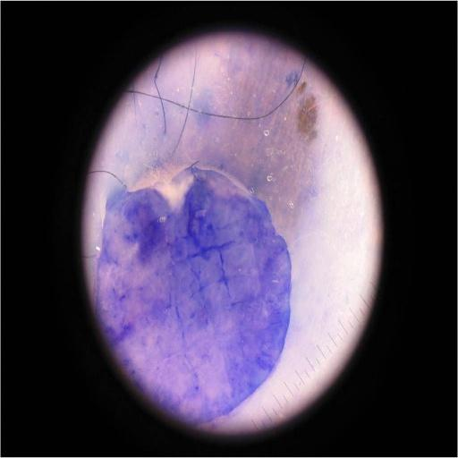

Clone this repository using the following command: 

git clone --depth 1 https://github.com/username/repository.git

It will download only the most recent commit history, make the clone faster and save memory space.

Then, run the notebook 'optimized'
